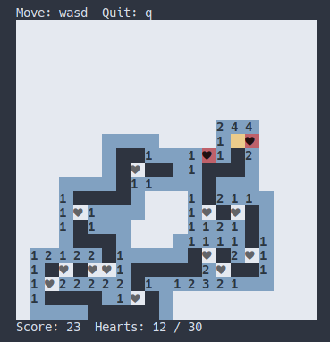

# ASM_SWEEPER



## 🇧🇷
O Asm Sweeper foi feito em Assembly x86_64 usando NASM para um projeto de arquitetura e organização de computadores do ICT-Unifesp.

Usei alguns códigos de https://github.com/NikitaIvanovV/snake-asm para fazer o terminal desenhar o mapa. A ideia da mecânica do jogo veio de https://cakethursday.itch.io/kelpie.

Para rodar o jogo é só ir rodar ```./sweeper``` no terminal depois de baixá-lo. Só há o executável do linux e não foi testado no windows, porém, para rodar no windows tem que alterar o arquivo Makefile de  ```-felf64 ``` para  ```-fwin32 ``` adicionar  ```.exe``` ao final do nome do arquivo.

## 🇺🇸
Asm Sweeper was made in x86_64 Assembly using NASM for a Computer architecture and organization project from ICT-Unifesp.

I used some codes from https://github.com/NikitaIvanovV/snake-asm to make the terminal draw the map. The idea for the game mechanics came from https://cakethursday.itch.io/kelpie.

To run the game just run ```./sweeper``` in the terminal after downloading it. There is only the linux executable and it has not been tested on windows, however, to run on windows you have to change the Makefile file from ```-felf64 ``` to ```-fwin32 ``` add ```.exe``` at the end of the file name.
